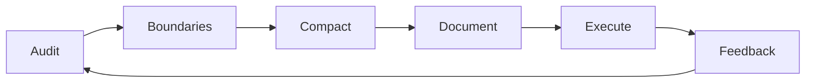

# Strategic Context Compaction
*Untuk AI Agent Coding (Claude Code, opencode, MiniMax M2.5)*

> **Status:** ✅ Siap Simpan | **Format:** Markdown | **Versi:** 1.0

---

## 1. KATEGORI UTAMA (TEMA BESAR)

Berdasarkan ekstraksi materi, seluruh pengetahuan dikristalkan menjadi **4 Kategori Inti**:

| Kategori | Cakupan |
|----------|---------|
| **A. Manajemen Konteks & Kompaksi** | Konsep compaction, batas konteks, strategi preservasi vs penghapusan |
| **B. Arsitektur Skill & Hook System** | Mekanisme `PreToolUse`, script monitoring, integrasi konfigurasi |
| **C. Kompatibilitas Multi-Model** | Adaptasi skill ke MiniMax M2.5, opencode, dan ekosistem Anthropic-compatible |
| **D. Optimasi Token & Efisiensi** | Pola lazy-loading, deteksi duplikasi, komposisi konteks |

---

## 2. SUB-TOPİK & PENJELASAN MENDALAM

### KATEGORI A: MANAJEMEN KONTEKS & KOMPAKSI

#### Sub-topik A.1: Strategic Compaction vs Auto-Compaction

**A. Inti Konsep**
- **Definisi:** Pendekatan manual terencana untuk menjalankan `/compact` pada batas logis tugas, bukan trigger otomatis acak.
- **Tujuan:** Mempertahankan konteks relevan sambil membuang "noise" eksplorasi, tanpa mengganggu alur kerja.
- **Masalah yang Diselesaikan:** Auto-compaction sering menghapus konteks penting di tengah tugas, menyebabkan AI "lupa" state parsial, variabel, atau jalur file.

**B. Mekanisme & Cara Kerja**
```
Alur Strategic Compaction:
1. User bekerja → AI melakukan tool calls (Edit/Write)
2. Script monitoring menghitung frekuensi tool calls
3. Saat threshold tercapai (default: 50) → notifikasi saran `/compact`
4. User evaluasi: "Apakah ini batas logis tugas?"
5. Jika YA → jalankan `/compact` dengan summary opsional
6. Jika TIDAK → lanjut kerja, reminder tiap +25 tool calls
```

**C. Komponen Penting**
| Komponen | Peran | Koneksi |
|----------|-------|---------|
| `suggest-compact.js` | Script monitoring & notifikasi | Dipicu via hook `PreToolUse` |
| `COMPACT_THRESHOLD` | Variabel env untuk batas trigger | Dikonfigurasi user (default: 50) |
| Decision Guide Table | Panduan kapan compact | Referensi human-in-the-loop |
| `/compact` command | Eksekusi kompaksi aktual | Native Claude Code feature |

**D. Use Case Nyata**
> **Skenario:** Migrasi fitur auth dari Express ke Fastify
> 1. Fase riset: Baca 10+ file dokumentasi, coba 3 pendekatan → konteks membengkak
> 2. *Batas logis:* Rencana migrasi sudah tertulis di `TODO.md`
> 3. → Jalankan `/compact Focus: implementasi migrasi auth Fastify`
> 4. Hasil: Konteks riset hilang (OK), tapi rencana + file target tetap tersedia
> 5. Lanjut implementasi dengan konteks "bersih" dan fokus

**E. Tools & Teknologi**
- **Claude Code / opencode:** Platform eksekusi skill
- **Node.js runtime:** Untuk menjalankan `suggest-compact.js`
- **JSON hooks config:** `~/.claude/settings.json` untuk integrasi
- **Environment variables:** Untuk kustomisasi threshold

**F. Evaluasi Kritis**
| Aspek | Analisis |
|-------|----------|
| ✅ Kelebihan | Kontrol penuh user, transparan, mencegah kehilangan konteks kritis, kompatibel multi-model |
| ❌ Kekurangan | Butuh disiplin user untuk evaluasi manual, tidak sepenuhnya otomatis |
| ⚠️ Batasan | Hanya memantau tool calls Edit/Write; tidak track read-only operations |
| 🔴 Risiko | Jika user ignor saran terus-menerus → konteks penuh → performa turun / error |

**G. Harga & Akses**
- **Skill:** Gratis (open source, GitHub `affaan-m/everything-claude-code`)
- **Platform:** Claude Code (~$100/bln Max), opencode (self-hosted/gratis), MiniMax M2.5 (~$50/bln via API)
- **Infrastruktur:** Butuh Node.js + akses file system lokal

**H. Perbandingan**
| Pendekatan | Cocok Untuk | Kapan Lebih Unggul |
|------------|-------------|-------------------|
| **Strategic Compact** | Workflow kompleks, multi-fase | Saat butuh kontrol presisi atas konteks |
| **Auto-Compaction** | Tugas sederhana, linear | Saat ingin "set-and-forget", risiko kehilangan konteks diterima |
| **Manual Full Reset** | Ganti proyek total | Saat konteks sudah sangat "tercemar" dan sulit diselamatkan |

---

### KATEGORI B: ARSITEKTUR SKILL & HOOK SYSTEM

#### Sub-topik B.1: Hook-Based Skill Architecture

**A. Inti Konsep**
- **Definisi:** Sistem ekstensi AI agent yang menggunakan *hooks* (intercept points) untuk menyisipkan logika kustom sebelum/sesudah aksi.
- **Tujuan:** Memungkinkan modifikasi perilaku AI tanpa mengubah model inti.
- **Masalah yang Diselesaikan:** Keterbatasan model statis dalam beradaptasi dengan workflow spesifik user.

**B. Mekanisme & Cara Kerja**
```
PreToolUse Hook Flow:
1. AI memutuskan: "Saya akan lakukan tool call: Edit file X"
2. Sistem intercept: "Tunggu, jalankan hook PreToolUse dulu"
3. Hook matcher: "Apakah tool-nya 'Edit' atau 'Write'?"
4. Jika match → eksekusi command: node suggest-compact.js
5. Script increment counter → cek threshold → return suggestion (jika ada)
6. Lanjutkan tool call asli AI
```

**C. Komponen Penting**
| Komponen | Fungsi | Lokasi |
|----------|--------|--------|
| `hooks.PreToolUse` | Intercept point sebelum tool eksekusi | `~/.claude/settings.json` |
| `matcher` | Filter berdasarkan jenis tool (Edit/Write/Read) | Config JSON |
| `command` | Script eksternal yang dieksekusi | Path ke `.js` file |
| `type: "command"` | Instruksi runner untuk eksekusi shell | Hook definition |

**D. Use Case Nyata**
> **Implementasi hook untuk strategic-compact:**
> ```json
> {
>   "hooks": {
>     "PreToolUse": [
>       {
>         "matcher": "Edit",
>         "hooks": [{ "type": "command", "command": "node ~/.claude/skills/strategic-compact/suggest-compact.js" }]
>       },
>       {
>         "matcher": "Write", 
>         "hooks": [{ "type": "command", "command": "node ~/.claude/skills/strategic-compact/suggest-compact.js" }]
>       }
>     ]
>   }
> }
> ```

**E. Tools & Teknologi**
- **JSON config parser:** Untuk membaca `settings.json`
- **Node.js child_process:** Untuk eksekusi script eksternal
- **File system watch (opsional):** Untuk deteksi perubahan config real-time

**F. Evaluasi Kritis**
| Aspek | Analisis |
|-------|----------|
| ✅ Kelebihan | Modular, reusable, tidak invasive, kompatibel dengan update platform |
| ❌ Kekurangan | Overhead eksekusi script eksternal (~50-200ms per hook), debugging lebih kompleks |
| ⚠️ Batasan | Hanya bekerja untuk tool calls yang didukung matcher; tidak track internal reasoning |
| 🔴 Risiko | Script error bisa blocking tool call; perlu error handling robust |

**G. Harga & Akses**
- Gratis (open source pattern)
- Butuh akses file system dan kemampuan eksekusi command (tidak tersedia di sandboxed environments)

**H. Perbandingan**
| Arsitektur | Fleksibilitas | Kompleksitas | Cocok Untuk |
|------------|---------------|--------------|-------------|
| **Hook-based** | Tinggi (dynamic injection) | Sedang | Skill kustom, workflow spesifik |
| **Plugin API** | Sedang (defined interface) | Rendah | Integrasi resmi, stabilitas tinggi |
| **Fine-tuning** | Rendah (static behavior) | Tinggi | Perilaku fundamental model |

---

### KATEGORI C: KOMPATIBILITAS MULTI-MODEL

#### Sub-topik C.1: Anthropic-Compatible API Abstraction

**A. Inti Konsep**
- **Definisi:** Pola konfigurasi yang memungkinkan client (Claude Code/opencode) berkomunikasi dengan model non-Anthropic via endpoint yang meniru protokol Anthropic.
- **Tujuan:** Reuse ekosistem tooling/skill tanpa modifikasi kode.
- **Masalah yang Diselesaikan:** Fragmentasi API antar provider AI; lock-in vendor.

**B. Mekanisme & Cara Kerja**
```
Compatibility Layer Flow:
1. User set env vars: ANTHROPIC_BASE_URL, ANTHROPIC_AUTH_TOKEN, ANTHROPIC_MODEL
2. Claude Code client: "Saya akan call Anthropic API"
3. Request dikirim ke: https://api.minimaxi.com/anthropic (bukan api.anthropic.com)
4. MiniMax proxy: Terima request Anthropic-format → translate ke internal format → proses → translate response kembali
5. Client terima response seolah dari Claude → lanjut normal
6. Skill hooks tetap bekerja karena layer aplikasi tidak tahu backend-nya diganti
```

**C. Komponen Penting**
| Komponen | Peran | Contoh Value |
|----------|-------|--------------|
| `ANTHROPIC_BASE_URL` | Endpoint API pengganti | `https://api.minimaxi.com/anthropic` |
| `ANTHROPIC_AUTH_TOKEN` | Autentikasi | `<MINIMAX_API_KEY>` |
| `ANTHROPIC_MODEL` | Identifier model | `MiniMax-M2.5` |
| `API_TIMEOUT_MS` | Timeout untuk model lebih lambat | `3000000` (50 menit) |

**D. Use Case Nyata**
> **Swap Claude → MiniMax M2.5 di opencode:**
> 1. Backup config lama
> 2. Update `~/.claude/settings.json`:
>    ```json
>    {
>      "env": {
>        "ANTHROPIC_BASE_URL": "https://api.minimaxi.com/anthropic",
>        "ANTHROPIC_AUTH_TOKEN": "mmx-xxx",
>        "ANTHROPIC_MODEL": "MiniMax-M2.5",
>        "COMPACT_THRESHOLD": "50"
>      }
>    }
>    ```
> 3. Jalankan `opencode` → `/model` → verifikasi `MiniMax-M2.5`
> 4. `/skills` → pastikan `strategic-compact` aktif
> 5. Kerja normal + skill tetap berfungsi

**E. Tools & Teknologi**
- **Proxy/Adapter layer:** MiniMax Anthropic-compatible endpoint
- **Environment variable manager:** `dotenv`, shell exports, atau config JSON
- **Model router (opsional):** Untuk switch model dinamis per task

**F. Evaluasi Kritis**
| Aspek | Analisis |
|-------|----------|
| ✅ Kelebihan | Hemat biaya (~50%), reuse skill ecosystem, fleksibilitas provider |
| ❌ Kekurangan | Potensi perbedaan perilaku model, dokumentasi kompatibilitas terbatas |
| ⚠️ Batasan | Tidak semua fitur Anthropic mungkin di-support 100% di proxy |
| 🔴 Risiko | Perubahan API proxy bisa break workflow; perlu monitoring versi |

**G. Harga & Akses**
| Provider | Model | Estimasi Biaya/Bulan | Akses |
|----------|-------|---------------------|-------|
| Anthropic | Claude Opus 4 | ~$100 (Max plan) | API key + subscription |
| MiniMax | M2.5 | ~$50 (Max plan) | API key + subscription |
| Self-hosted | Llama 3.1, dll | $0 (hardware sendiri) | Ollama, vLLM, dll |

**H. Perbandingan**
| Kriteria | Anthropic Native | MiniMax via Compatible API | Self-hosted Open Source |
|----------|-----------------|---------------------------|------------------------|
| **Kualitas Coding** | ⭐⭐⭐⭐⭐ | ⭐⭐⭐⭐ | ⭐⭐⭐ (tergantung model) |
| **Biaya** | Tinggi | Sedang | Rendah (CapEx hardware) |
| **Kontrol Data** | Sedang | Sedang | Tinggi |
| **Kompatibilitas Skill** | Native | ✅ via adapter | ⚠️ butuh testing |
| **Latensi** | Rendah | Sedang (proxy overhead) | Bervariasi |

---

### KATEGORI D: OPTIMASI TOKEN & EFISIENSI

#### Sub-topik D.1: Context Composition & Token Budgeting

**A. Inti Konsep**
- **Definisi:** Praktik sadar mengelola alokasi token dalam context window berdasarkan prioritas informasi.
- **Tujuan:** Maksimalkan kualitas respons dalam batas konteks terbatas.
- **Masalah yang Diselesaikan:** Context overflow → truncation → kehilangan instruksi kritis atau state.

**B. Mekanisme & Cara Kerja**
```
Token Budgeting Workflow:
1. Audit: Identifikasi sumber konsumsi token (CLAUDE.md, skills, history, tool results)
2. Prioritize: Rank informasi: Critical > Important > Nice-to-have > Disposable
3. Compress: Terapkan pola optimasi (lazy-load, deduplication, summarization)
4. Monitor: Track usage via tool calls atau MCP token-optimizer
5. Compact: Eksekusi strategic compaction saat threshold tercapai
```

**C. Komponen Penting**
| Pola Optimasi | Deskripsi | Penghematan Estimasi |
|---------------|-----------|---------------------|
| **Trigger-Table Lazy Loading** | Load skill hanya saat keyword terdeteksi | 50%+ baseline context |
| **Duplicate Instruction Detection** | Hapus aturan berulang di rules/ vs CLAUDE.md | 10-30% redundansi |
| **Context Virtualization** | Simpan state eksternal, load on-demand | 95%+ reduction (demo) |
| **Summary-First Compact** | `/compact` dengan pesan fokus | Preservasi intent kritis |

**D. Use Case Nyata**
> **Optimasi sesi full-stack development:**
> ```
> Sebelum:
> - CLAUDE.md: 2.1K tokens
> - 5 skills loaded: 12.5K tokens  
> - History 50 message: 18K tokens
> - Tool results (file reads): 45K tokens
> TOTAL: ~77.6K / 200K (39% terpakai)
>
> Setelah optimasi:
> - CLAUDE.md dipangkas ke 1.2K (-43%)
> - Lazy-load skills: hanya 2 aktif (3.1K) (-75%)
> - History di-compact dengan summary: 4.2K (-77%)
> - Tool results: simpan path saja, load konten saat perlu (-60%)
> TOTAL: ~12.5K / 200K (6% terpakai) → ruang untuk 16x lebih banyak eksekusi
> ```

**E. Tools & Teknologi**
- `token-optimizer` MCP: Automated deduplication & compression
- `context-mode` feature: Virtualization context (jika didukung platform)
- Custom script: Untuk audit token usage per komponen
- Logging hook: Track token consumption real-time

**F. Evaluasi Kritis**
| Aspek | Analisis |
|-------|----------|
| ✅ Kelebihan | Ekstensibilitas sesi, konsistensi kualitas, efisiensi biaya API |
| ❌ Kekurangan | Overhead setup awal, butuh pemahaman arsitektur konteks |
| ⚠️ Batasan | Tidak semua informasi bisa dikompresi tanpa loss; beberapa konteks inherently verbose |
| 🔴 Risiko | Over-optimization → kehilangan nuance penting; perlu testing dampak pada kualitas output |

**G. Harga & Akses**
- Tools optimasi: Gratis (open source MCP servers)
- Platform fitur advanced: Mungkin butuh plan berbayar (Claude Max, dll)

**H. Perbandingan**
| Strategi | Kompleksitas | Penghematan | Risiko Loss |
|----------|--------------|-------------|-------------|
| **Strategic Compact** | Rendah | Sedang (20-40%) | Rendah (human-in-the-loop) |
| **Lazy-Load Skills** | Sedang | Tinggi (50%+) | Sedang (delay load pertama) |
| **Context Virtualization** | Tinggi | Sangat Tinggi (95%+) | Tinggi (butuh state management eksternal) |
| **Aggressive Auto-Compact** | Rendah | Tinggi | Sangat Tinggi (kehilangan konteks tak terduga) |

---

## 3. SINTESIS PENGETAHUAN (INTI KECERDASAN)

### 🔑 Prinsip Utama (Core Principles)
1. **Konteks adalah resource terbatas** → Kelola seperti budget, bukan infinite buffer.
2. **Batas logis > batas arbitrer** → Kompaksi berdasarkan milestone tugas, bukan hitungan acak.
3. **Human-in-the-loop untuk keputusan kritis** → AI saran, user putuskan (terutama untuk compaction).
4. **Kompatibilitas via abstraction** → Pisahkan logic skill dari implementasi model backend.
5. **Optimasi bertahap > all-at-once** → Audit → Prioritize → Compress → Monitor → Iterate.

### 🔁 Pola Berulang (Patterns)
| Pola | Trigger | Aksi | Outcome |
|------|---------|--------|---------|
| **Explore → Plan → Compact → Execute** | Selesai riset, rencana sudah terdokumentasi | `/compact` dengan summary fokus | Konteks bersih untuk eksekusi |
| **Debug → Resolve → Compact → Continue** | Error terpecahkan, root cause tercatat | `/compact Clear: lanjut fitur Y` | Hindari polusi konteks debugging |
| **Skill Lazy-Load on Keyword** | User sebut keyword domain (e.g., "security") | Load skill relevan dinamis | Hemat baseline context |
| **Duplicate Rule Detection** | Setup project baru / tambah skill | Scan & hapus redundansi rules | Hindari konflik instruksi |

### 💡 Insight Penting (Takeaways)
> - **"Compact setelah eksplorasi, sebelum eksekusi"** adalah heuristik terkuat untuk menjaga fokus tanpa kehilangan arah.
> - **Hook system adalah force multiplier**: Satu skill bisa meningkatkan banyak model via abstraction layer.
> - **Kompatibilitas API > kompatibilitas model**: Selama protokol sama, ekosistem tooling bisa direuse.
> - **Token optimization adalah skill meta**: Menguasai ini membuat semua skill lain lebih efektif.
> - **Jangan optimasi prematur**: Audit dulu baru kompres; blind compression bisa merusak kualitas.

---

## 4. SISTEM / FRAMEWORK: WORKFLOW REUSABLE

### 🔄 Framework "CONTEXT CYCLE" (6 Langkah)



#### Langkah 1: AUDIT (Setiap 25-50 tool calls)
```bash
# Cek konsumsi konteks
/compact --dry-run  # Jika didukung
# Atau manual: hitung estimasi:
# - CLAUDE.md: ~2K
# - Skills aktif: N x 2.5K  
# - History: messages x 300 tokens
# - Tool results: file_reads x avg_size
```

#### Langkah 2: BOUNDARIES (Evaluasi posisi workflow)
Gunakan Decision Guide:
```
[ ] Apakah fase tugas sudah selesai? (research→plan→implement)
[ ] Apakah ada milestone tercapai? (fitur X done)
[ ] Apakah konteks saat ini "tercemar" debug/eksplorasi?
[ ] Apakah next task butuh konteks fresh?
→ Jika 2+ YA: Kandidat kuat untuk compact
```

#### Langkah 3: COMPACT (Eksekusi terencana)
```bash
# Format optimal:
/compact [FOKUS]: [NEXT ACTION]
# Contoh:
/compact Focus: implementasi auth middleware dengan JWT
/compact Next: testing API endpoint /users
```

#### Langkah 4: DOCUMENT (Preservasi state kritis)
Sebelum compact, pastikan:
- [ ] Rencana tertulis di `TODO.md` atau `TodoWrite`
- [ ] Variabel/konfigurasi penting disimpan di file
- [ ] Insight kunci dicatat di `~/.claude/memory/` atau `CLAUDE.md`
- [ ] Git commit untuk state code yang stabil

#### Langkah 5: EXECUTE (Lanjut kerja dengan konteks bersih)
- Mulai task berikutnya
- Monitor kualitas respons: apakah lebih fokus? lebih cepat?
- Catat jika ada konteks penting yang ternyata hilang (untuk refine future compaction)

#### Langkah 6: FEEDBACK (Iterasi sistem)
```bash
# Update konfigurasi berdasarkan pengalaman:
export COMPACT_THRESHOLD=65  # Jika 50 terlalu agresif
# Atau tambah hook matcher baru:
# - Tambahkan "Read" jika perlu track file access
# - Tambahkan custom script untuk log token usage
```

### 🎯 Checklist Cepat: "Should I Compact Now?"

```markdown
## ✅ Kompaksi Direkomendasikan Jika:
- [ ] Sudah 50+ tool calls sejak last compact
- [ ] Baru selesai satu fase besar (riset/planning/debugging)
- [ ] Akan beralih ke task yang tidak related
- [ ] Respons AI mulai lambat / kurang koheren
- [ ] Context window >70% terpakai (estimasi)

## ❌ Tunda Kompaksi Jika:
- [ ] Sedang di tengah implementasi fitur yang sama
- [ ] Masih dalam eksplorasi aktif (belum ada rencana final)
- [ ] Baru saja load skill/konteks penting
- [ ] Dalam sesi debugging kompleks yang belum resolve

## ⚡ Kompaksi Darurat Jika:
- [ ] Error "context window exceeded"
- [ ] AI mulai mengulang-ulang atau hallucinate parah
- [ ] Token usage >90% (risk of truncation)
```

---

## 5. OUTPUT ARTEFAK: `.skill` TEMPLATE

```skill
# strategic-compact-v2.skill
# Deskripsi: Sistem manajemen konteks strategis untuk AI agent coding
# Kompatibel: Claude Code, opencode, MiniMax M2.5, Gemini CLI, Copilot
# Author: [Your Name] | License: MIT

[CONFIG]
threshold_default = 50
reminder_interval = 25
monitored_tools = ["Edit", "Write"]
compact_command = "/compact"

[HOOKS]
PreToolUse.Edit = "node ~/.claude/skills/strategic-compact/suggest-compact.js"
PreToolUse.Write = "node ~/.claude/skills/strategic-compact/suggest-compact.js"

[DECISION_GUIDE]
# Format: PHASE_TRANSITION | COMPACT? | REASON
Research→Planning | YES | Research bulky, plan distilled
Planning→Implementation | YES | Plan persisted, free context for code
Implementation→Testing | MAYBE | Keep if tests reference recent code
Debugging→NextFeature | YES | Debug traces pollute new context
MidImplementation | NO | Risk losing partial state
FailedApproach→Retry | YES | Clear dead-end reasoning

[PERSISTENCE_RULES]
# Apa yang SELAMAT saat compact:
persist:
  - CLAUDE.md instructions
  - TodoWrite task list
  - Memory files (~/.claude/memory/*)
  - Git state (commits, branches, diffs)
  - Files on disk

# Apa yang HILANG saat compact:
discard:
  - Intermediate reasoning & analysis
  - File contents previously read (not saved)
  - Multi-step conversation history
  - Tool call history & counters
  - Verbal user preferences (not in files)

[OPTIMIZATION_PATTERNS]
## Trigger-Table Lazy Loading
trigger_table:
  - triggers: ["test", "tdd", "coverage"] → skill: tdd-workflow
  - triggers: ["security", "auth", "xss"] → skill: security-review  
  - triggers: ["deploy", "ci/cd", "docker"] → skill: deployment-patterns

## Duplicate Detection Rules
dedup_rules:
  - scan: ["~/.claude/rules/", "./.claude/rules/", "CLAUDE.md"]
  - detect: identical_instructions
  - action: keep_highest_priority_source

## Context Budget Template
budget_template:
  critical: 30%    # CLAUDE.md, active plan, current file
  important: 40%   # Recent history, loaded skills, tool results  
  disposable: 30%  # Old history, exploration context, debug traces

[WORKFLOW]
## CONTEXT CYCLE - 6 Langkah
1. AUDIT: Cek token usage & tool call count
2. BOUNDARIES: Evaluasi posisi workflow vs decision guide
3. COMPACT: Eksekusi dengan format: /compact [FOKUS]: [NEXT]
4. DOCUMENT: Pastikan state kritis tersimpan di file/memory
5. EXECUTE: Lanjut kerja dengan konteks bersih
6. FEEDBACK: Update threshold/config berdasarkan hasil

[QUICK_CHECK]
compact_now_if:
  - tool_calls_since_last >= threshold
  - phase_transition_completed == true
  - context_usage_percent > 70
  - response_quality_degraded == true

delay_compact_if:
  - mid_implementation == true
  - active_exploration == true
  - critical_context_just_loaded == true

emergency_compact_if:
  - context_window_exceeded_error == true
  - token_usage_percent > 90
  - hallucination_severity == high

[ENV_VARS]
COMPACT_THRESHOLD: "50"        # Tool calls before first suggestion
COMPACT_REMINDER_INTERVAL: "25" # Reminder frequency after threshold
LOG_TOKEN_USAGE: "false"       # Enable detailed token logging
DRY_RUN_MODE: "false"          # Test suggestions without executing

[INSTALL]
# One-liner install:
npx skills add https://github.com/affaan-m/everything-claude-code --skill strategic-compact

# Manual setup:
1. Clone repo ke ~/.claude/skills/strategic-compact/
2. Tambahkan hooks ke ~/.claude/settings.json (lihat [HOOKS])
3. Set env vars sesuai kebutuhan (lihat [ENV_VARS])
4. Restart agent / reload config

[TEST]
# Verifikasi instalasi:
1. Jalankan agent: claude / opencode
2. Cek model: /model → pastikan target model aktif
3. Cek skill: /skills → strategic-compact harus terdaftar
4. Trigger test: Lakukan 5x Edit/Write → harus muncul saran compact di call ke-50

[TROUBLESHOOTING]
## Skill tidak muncul di /skills?
- Pastikan path script benar di hooks config
- Cek izin eksekusi: chmod +x suggest-compact.js
- Verifikasi Node.js tersedia di PATH

## Tidak ada notifikasi saat threshold?
- Cek COMPACT_THRESHOLD env var
- Pastikan hook matcher mencakup tool yang digunakan
- Review log: tambahkan console.log di script untuk debug

## Kompaksi menghapus konteks penting?
- Review [PERSISTENCE_RULES]: pastikan state kritis disimpan di file
- Gunakan format /compact dengan summary eksplisit
- Pertimbangkan naikkan threshold jika terlalu agresif

[UPGRADE_PATH]
v1.0 → v2.0:
- Tambahkan lazy-loading trigger table
- Integrasi token-optimizer MCP untuk audit otomatis
- Tambahkan context virtualization support (jika platform mendukung)

[RELATED_SKILLS]
- continuous-learning: Ekstrak pola sebelum session end
- memory-persistence: State management yang survive compaction
- token-optimizer: Automated deduplication & compression
```

---

> 📦 **Cara Simpan:**  
> 1. Copy seluruh konten di atas  
> 2. Simpan sebagai `strategic-compact-knowledge-system.md`  
> 3. Untuk artefak `.skill`: simpan bagian terakhir sebagai `strategic-compact-v2.skill`  
> 4. Commit ke repo knowledge base Anda untuk reuse & kolaborasi  

> 🔁 **Update Siklus:** Review & refine sistem ini setiap 2-4 minggu berdasarkan pengalaman nyata penggunaan.  

*Disusun dengan pendekatan: System Thinking • First Principles • Knowledge Compression* 🧠✨