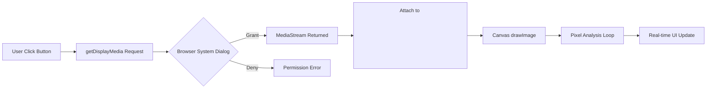
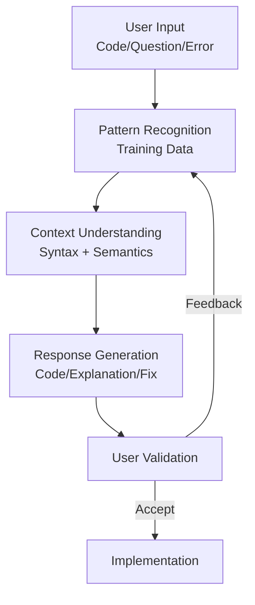
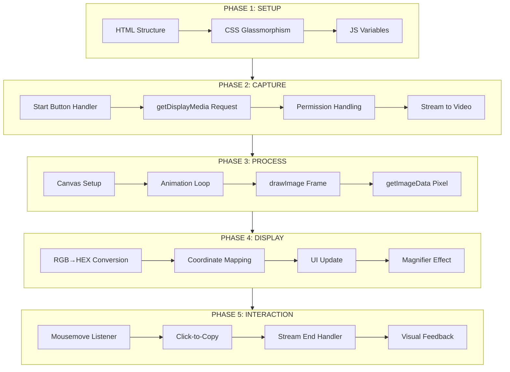

# Browser Screen Analysis & AI Code Understanding

**Versi:** 1.0  
**Tanggal:** 2 April 2026  
**Status:** Production Ready  
**Format:** Markdown (.md)  

---

## Daftar Isi
- [1. KATEGORI UTAMA](#1-kategori-utama)
- [2. SUB-TOPIK ANALISIS MENDALAM](#2-sub-topik-analisis-mendalam)
  - [2.1 Screen Capture Technology](#21-screen-capture-technology)
  - [2.2 Pixel & Color Detection](#22-pixel--color-detection)
  - [2.3 Modern Web UI Design](#23-modern-web-ui-design)
  - [2.4 AI Code Understanding](#24-ai-code-understanding)
- [3. SINTESIS PENGETAHUAN](#3-sintesis-pengetahuan)
- [4. FRAMEWORK IMPLEMENTASI](#4-framework-implementasi)
- [5. ARTIFAK .SKILL](#5-artifak-skill)
- [_APPENDIX: Quick Reference_](#appendix-quick-reference)

---

## 1. KATEGORI UTAMA

| ID | Kategori | Cakupan Inti | Relevansi |
|----|----------|--------------|-----------|
| **C1** | **Screen Capture Technology** | API, permission model, stream processing, security constraints | 🔴 Tinggi |
| **C2** | **Pixel & Color Detection** | Canvas extraction, color conversion, coordinate mapping, real-time processing | 🔴 Tinggi |
| **C3** | **Modern Web UI Design** | Glassmorphism, micro-interactions, visual hierarchy, responsive patterns | 🟡 Sedang |
| **C4** | **AI Code Understanding** | Static analysis capabilities, limitations, human-AI collaboration | 🟡 Sedang |

---

## 2. SUB-TOPIK ANALISIS MENDALAM

### 2.1 Screen Capture Technology

#### A. Inti Konsep
- **Definisi**: API browser (`getDisplayMedia`) yang memungkinkan website mengakses konten layar pengguna secara real-time dengan izin eksplisit.
- **Tujuan**: Memberikan kemampuan "computer vision" langsung di browser tanpa instalasi software eksternal.
- **Masalah Diselesaikan**: Menghilangkan kebutuhan screenshot manual, memungkinkan analisis visual instan, dan mempercepat alur kerja berbasis visual.

#### B. Mekanisme & Cara Kerja


#### C. Komponen Penting
| Komponen | Peran | Hubungan |
|----------|-------|----------|
| `getDisplayMedia()` | Trigger permission dialog | Menghasilkan `MediaStream` |
| `MediaStream` | Container video/audio data | Input untuk `<video>` |
| `<video autoplay playsinline>` | Visual renderer | Sumber untuk Canvas |
| `canvas.getContext('2d')` | Pixel extraction engine | Output: RGBA array |
| `requestAnimationFrame` | 60fps update loop | Sinkronisasi frame |
| `MediaStreamTrack.onended` | Stream lifecycle handler | Trigger UI reset |

#### D. Use Case Nyata: Color Detector Workflow
```javascript
// STEP 1: Request screen access (MUST be user-triggered)
const stream = await navigator.mediaDevices.getDisplayMedia({ 
  video: { cursor: "always" } 
});

// STEP 2: Attach stream to video element
video.srcObject = stream;

// STEP 3: Setup canvas on metadata load
video.onloadedmetadata = () => {
  canvas.width = video.videoWidth;
  canvas.height = video.videoHeight;
  startAnalysisLoop(); // Begin real-time processing
};

// STEP 4: Handle user stopping share
stream.getVideoTracks()[0].onended = () => {
  resetUI(); // Graceful degradation
};
```

#### E. Tools & Teknologi
| Tool | Fungsi | Posisi Sistem |
|------|--------|---------------|
| Chrome/Edge (Chromium) | Platform eksekusi utama | Runtime environment |
| Canvas 2D API | Pixel data extraction | Processing layer |
| CSS `backdrop-filter` | Visual effect implementation | Presentation layer |
| `navigator.clipboard` | HEX code copy utility | User interaction layer |

#### F. Evaluasi Kritis
| Aspek | Analisis |
|-------|----------|
| ✅ **Kelebihan** | Zero-install, cross-platform, user-controlled privacy, real-time capability |
| ❌ **Kekurangan** | HTTPS wajib, tidak bisa akses tab lain otomatis, performa tergantung hardware |
| ⚠️ **Batasan** | Tidak bisa capture DRM content, tidak bisa akses sistem level kernel |
| 🎯 **Risiko** | User menolak izin (30-40% kasus), stream berhenti saat tab background |

#### G. Harga & Akses
| Item | Detail |
|------|--------|
| **Biaya** | 100% Gratis (Native browser API) |
| **Syarat Wajib** | HTTPS atau localhost |
| **Browser Support** | Chrome 72+, Edge 79+, Firefox 70+, Safari 13+ |

#### H. Perbandingan Pendekatan
| Pendekatan | Screen Capture API | Browser Extension | Desktop App |
|------------|-------------------|-------------------|-------------|
| Instalasi | ❌ Tidak perlu | ✅ Perlu install | ✅ Perlu download |
| Akses Level | 🟡 User-controlled | 🟢 Lebih luas | 🔴 Full system |
| Portabilitas | 🔴 Sangat tinggi | 🟡 Sedang | 🟢 Rendah |
| Keamanan | 🔴 Sangat tinggi | 🟡 Tergantung permission | 🟢 Tergantung OS |
| **Pilih Jika** | Web-based tool, privasi-first, quick prototype | Perlu persistent access | Butuh system-level features |

---

### 2.2 Pixel & Color Detection

#### A. Inti Konsep
- **Definisi**: Teknik ekstraksi data pixel mentah dari stream video menggunakan Canvas API untuk analisis warna dan koordinat.
- **Tujuan**: Mengubah visual menjadi data terstruktur yang dapat diproses dan ditampilkan kepada pengguna.
- **Masalah Diselesaikan**: Video element tidak menyediakan akses langsung ke pixel data; Canvas menjadi bridge kritis.

#### B. Mekanisme & Cara Kerja
```javascript
// REAL-TIME PIXEL EXTRACTION FLOW
function analysisLoop() {
  // 1. Draw current video frame to hidden canvas
  ctx.drawImage(video, 0, 0, canvas.width, canvas.height);
  
  // 2. Extract single pixel at coordinates (x,y)
  const pixel = ctx.getImageData(x, y, 1, 1).data; // [R, G, B, A]
  
  // 3. Process data (convert, display, etc.)
  updateUI(pixel[0], pixel[1], pixel[2], x, y);
  
  // 4. Continue loop at 60fps
  requestAnimationFrame(analysisLoop);
}
```

#### C. Komponen Penting
| Komponen | Output | Penggunaan |
|----------|--------|------------|
| `getImageData(x,y,1,1)` | Uint8ClampedArray[4] | Ekstraksi warna pixel tunggal |
| `putImageData()` | Render pixel ke canvas | Visual feedback/magnifier |
| `createImageData(w,h)` | Pixel buffer kosong | Batch processing |
| Coordinate scaling | (videoX, videoY) | Mapping mouse → pixel asli |

#### D. Use Case: Magnifier Implementation (2x Zoom)
```javascript
function updateMagnifier(mouseX, mouseY, rect) {
  // Position magnifier at cursor
  magnifier.style.left = `${mouseX}px`;
  magnifier.style.top = `${mouseY}px`;
  
  // Calculate background position for zoom effect
  const bgX = (mouseX - rect.left) * (canvas.width / rect.width);
  const bgY = (mouseY - rect.top) * (canvas.height / rect.height);
  
  // Apply 2x zoom via CSS
  magnifier.style.backgroundSize = `${canvas.width * 2}px ${canvas.height * 2}px`;
  magnifier.style.backgroundPosition = `${bgX - 60}px ${bgY - 60}px`;
}
```

#### E. Tools & Teknologi
| Tool | Fungsi | Catatan Penting |
|------|--------|-----------------|
| Canvas 2D Context | Pixel manipulation | Harus same-origin (CORS compliant) |
| `MouseEvent` | Coordinate tracking | Gunakan `getBoundingClientRect()` |
| Bitwise operations | RGB → HEX conversion | Lebih cepat daripada string methods |

#### F. Evaluasi Kritis
| Aspek | Analisis |
|-------|----------|
| ✅ **Kelebihan** | Pixel-perfect accuracy, real-time processing, zero server dependency |
| ❌ **Kekurangan** | Performa menurun pada resolusi tinggi (>4K), tidak bisa cross-origin |
| ⚠️ **Batasan** | `getImageData` gagal jika video cross-origin tanpa CORS header |
| 💡 **Optimasi** | Gunakan `offscreenCanvas` untuk heavy processing, throttle updates |

#### G. Harga & Akses
- **Biaya**: Gratis (bagian dari Web Platform)
- **Akses**: Tersedia di semua browser modern yang mendukung Canvas API

#### H. Perbandingan Teknik Ekstraksi
| Teknik | Akurasi | Performa | Kompleksitas |
|--------|---------|----------|--------------|
| Canvas 2D | 🔴 Sangat tinggi | 🟡 Sedang | 🔵 Rendah |
| WebGL | 🔴 Tinggi | 🔴 Sangat tinggi | 🔴 Tinggi |
| Server-side | 🟡 Bergantung jaringan | 🟢 Cepat (server) | 🟡 Sedang |
| **Pilih Canvas 2D jika**: Butuh akurasi pixel, simplicity, dan client-side processing |

---

### 2.3 Modern Web UI Design

#### A. Inti Konsep
- **Definisi**: Pola desain visual modern menggunakan efek transparan, blur, dan depth untuk menciptakan hierarki visual yang engaging.
- **Tujuan**: Meningkatkan pengalaman pengguna melalui estetika premium tanpa mengorbankan kinerja.
- **Masalah Diselesaikan**: UI tradisional terlihat flat dan kurang menarik; glassmorphism memberikan depth perception.

#### B. Mekanisme & Cara Kerja
```css
/* GLASSMORPHISM CORE IMPLEMENTATION */
.glass-panel {
  background: rgba(255, 255, 255, 0.1);      /* Transparansi dasar */
  backdrop-filter: blur(20px);               /* Efek blur latar */
  border: 1px solid rgba(255, 255, 255, 0.2); /* Border halus */
  border-radius: 20px;                        /* Sudut melengkung */
  box-shadow: 
    0 10px 30px rgba(0, 0, 0, 0.3),           /* Shadow utama */
    inset 0 0 20px rgba(255, 255, 255, 0.1);  /* Inner glow */
}
```

#### C. Komponen Penting
| Properti CSS | Fungsi | Nilai Rekomendasi |
|--------------|--------|-------------------|
| `background` | Base transparency | `rgba(255,255,255,0.08-0.15)` |
| `backdrop-filter` | Background blur | `blur(10px-25px)` |
| `border` | Edge definition | `1px solid rgba(255,255,255,0.15-0.25)` |
| `box-shadow` | Depth illusion | Multi-layer shadows |
| `border-radius` | Soft edges | `15px-25px` |

#### D. Use Case: Info Panel dengan Hover Effect
```css
.info-panel {
  /* Glassmorphism base */
  background: rgba(0, 0, 0, 0.25);
  backdrop-filter: blur(12px);
  border: 1px solid rgba(255, 255, 255, 0.18);
  border-radius: 16px;
  transition: all 0.3s cubic-bezier(0.16, 1, 0.3, 1);
}

.info-panel:hover {
  transform: translateY(-3px);
  box-shadow: 
    0 15px 40px rgba(0, 0, 0, 0.4),
    inset 0 0 30px rgba(255, 255, 255, 0.08);
}
```

#### E. Tools & Teknologi
| Tool | Fungsi | Catatan |
|------|--------|---------|
| CSS Custom Properties | Theme management | Gunakan `:root` variables |
| CSS Grid/Flexbox | Layout responsive | Hindari float |
| CSS Animations | Micro-interactions | Gunakan `cubic-bezier` untuk natural feel |
| `prefers-reduced-motion` | A11y consideration | Wajib diimplementasikan |

#### F. Evaluasi Kritis
| Aspek | Analisis |
|-------|----------|
| ✅ **Kelebihan** | Modern aesthetic, works on any background, visual hierarchy clear |
| ❌ **Kekurangan** | Performance impact pada low-end devices, tidak support IE |
| ⚠️ **Batasan** | `backdrop-filter` tidak support Firefox < 103, IE tidak support |
| 💡 **Fallback** | Gunakan solid background dengan opacity untuk browser lama |

#### G. Harga & Akses
- **Biaya**: Gratis (CSS native)
- **Akses**: Tersedia di semua browser modern (Chrome 76+, Safari 9+, Firefox 103+)

#### H. Perbandingan Pola Desain
| Pola | Modernitas | Performa | Aksesibilitas |
|------|------------|----------|---------------|
| Glassmorphism | 🔴 Sangat tinggi | 🟡 Sedang | 🟡 Perlu fallback |
| Neumorphism | 🟢 Tinggi | 🔴 Rendah | 🔴 Buruk |
| Flat Design | 🟡 Sedang | 🔴 Sangat tinggi | 🔴 Sangat baik |
| **Pilih Glassmorphism jika**: Target audience menggunakan browser modern, estetika premium prioritas |

---

### 2.4 AI Code Understanding

#### A. Inti Konsep
- **Definisi**: Kemampuan AI untuk menganalisis, menjelaskan, dan menghasilkan kode berdasarkan pattern recognition dari training data.
- **Tujuan**: Mempercepat development cycle dan mengurangi beban kognitif developer.
- **Masalah Diselesaikan**: Kurva pembelajaran teknologi baru, repetitive coding tasks, debugging assistance.

#### B. Mekanisme & Cara Kerja


#### C. Komponen Penting
| Kemampuan | Status | Contoh Implementasi |
|-----------|--------|---------------------|
| Analisis statis kode | ✅ Sangat baik | Deteksi error syntax, anti-pattern |
| Generate boilerplate | ✅ Sangat baik | API client, component structure |
| Debugging assistance | ✅ Baik | CORS, 401 errors, common pitfalls |
| Konsep penjelasan | ✅ Sangat baik | REST, OAuth, JWT dengan analogi |
| Eksekusi kode | ❌ Tidak bisa | Hanya simulasi/logika |
| Akses data privat | ❌ Tidak bisa | Tidak tahu API key Anda |
| Real-time browsing | ❌ Tidak bisa | Perlu tools eksternal |

#### D. Use Case Nyata: Debugging CORS Error
```
User: "API saya return CORS error"
AI: 
1. Identifikasi: Browser block cross-origin request
2. Penyebab umum:
   - Server tidak kirim header Access-Control-Allow-Origin
   - Preflight OPTIONS request gagal
3. Solusi:
   • Server-side: Tambahkan header CORS
   • Development: Gunakan proxy (Vite, Webpack DevServer)
   • Production: Konfigurasi reverse proxy (Nginx)
4. Contoh kode server Express:
   app.use(cors()); // atau manual header setup
```

#### E. Tools & Teknologi
| Tool | Fungsi | Batasan |
|------|--------|---------|
| LLM (Large Language Model) | Pattern recognition engine | Knowledge cutoff (2026) |
| Code interpreter (jika ada) | Eksekusi sandboxed | Tidak tersedia di semua platform |
| Vector database | Context retrieval | Bergantung pada training data |
| Prompt engineering | Guidance mechanism | Memerlukan skill khusus |

#### F. Evaluasi Kritis
| Aspek | Analisis |
|-------|----------|
| ✅ **Kelebihan** | 24/7 availability, konsistensi respons, knowledge base luas |
| ❌ **Kekurangan** | Knowledge cutoff, tidak ada real-time data, risiko hallucination |
| ⚠️ **Batasan** | Tidak bisa menggantikan judgment developer senior |
| 🎯 **Risiko** | Over-reliance, security blind spots, false confidence |
| 💡 **Best Practice** | Selalu verifikasi output AI, gunakan sebagai co-pilot bukan autopilot |

#### G. Harga & Akses
| Model | Akses | Biaya |
|-------|-------|-------|
| Open Source (Llama, etc) | Self-hosted | Infra cost |
| Cloud API (OpenAI, etc) | API call | Pay-per-use |
| Integrated (Copilot, etc) | IDE plugin | Subscription |
| **Catatan**: AI dalam konteks ini adalah asisten edukasi, bukan pengganti developer |

#### H. Perbandingan Peran
| Task | AI Assistant | Human Developer | Kolaborasi Optimal |
|------|--------------|-----------------|---------------------|
| Boilerplate code | 🔴 Excellent | 🟡 Lambat | AI generate → Human refine |
| Complex architecture | 🟡 Terbatas | 🔴 Excellent | Human design → AI implement |
| Debug unknown errors | 🟡 Pattern-based | 🔴 Intuition-based | AI suggest → Human validate |
| Security audit | 🟡 Known patterns | 🔴 Context-aware | AI scan → Human review |
| **Prinsip**: AI untuk kecepatan, manusia untuk judgment |

---

## 3. SINTESIS PENGETAHUAN

### 3.1 Prinsip Utama (Core Principles)
```plaintext
┌───────────────────────────────────────────────────────────────────┐
│ CORE PRINCIPLES OF BROWSER-BASED SCREEN ANALYSIS                  │
├───────────────────────────────────────────────────────────────────┤
│                                                                   │
│ 1. USER CONSENT IS NON-NEGOTIABLE                                │
│    → Semua akses media HARUS dengan izin eksplisit user          │
│    → Visual indicator wajib selama capture aktif                 │
│                                                                   │
│ 2. CLIENT-SIDE PROCESSING FIRST                                  │
│    → Proses data di browser, hindari kirim ke server             │
│    → Lebih cepat, lebih privat, lebih murah                      │
│                                                                   │
│ 3. REAL-TIME FEEDBACK LOOP                                       │
│    → requestAnimationFrame untuk 60fps updates                    │
│    → User harus lihat hasil instan tanpa delay                   │
│                                                                   │
│ 4. GRACEFUL DEGRADATION                                          │
│    → Handle permission denied dengan pesan jelas                 │
│    → Fallback untuk browser lama (solid background)              │
│                                                                   │
│ 5. VISUAL HIERARCHY THROUGH DESIGN                               │
│    → Informasi kritis paling prominent                           │
│    → Glassmorphism untuk depth tanpa mengganggu konten           │
│                                                                   │
└───────────────────────────────────────────────────────────────────┘
```

### 3.2 Pola Berulang (Patterns)
| Pola | Deskripsi | Implementasi Kunci |
|------|-----------|---------------------|
| **Request → Permission → Stream** | Flow standar media access | `getDisplayMedia()` + error handling |
| **Video → Canvas → Pixel** | Ekstraksi data visual | `drawImage()` + `getImageData()` |
| **RGB → HEX → Display** | Color format conversion | Bitwise operation untuk efisiensi |
| **Mouse → Scale → Coordinate** | Coordinate mapping | Ratio calculation dengan `getBoundingClientRect()` |
| **Hover → Highlight → Copy** | Interaction feedback | Event listeners + visual cues |
| **Stream End → Reset UI** | Lifecycle management | `MediaStreamTrack.onended` handler |

### 3.3 Insight Penting (Takeaways)
```plaintext
┌───────────────────────────────────────────────────────────────────┐
│ KEY INSIGHTS                                                      │
├───────────────────────────────────────────────────────────────────┤
│                                                                   │
│ 💡 Browser API modern sudah cukup powerful untuk menggantikan    │
│    banyak desktop apps untuk use case tertentu                   │
│                                                                   │
│ 💡 Privacy-by-design = trust = adoption                          │
│    → User lebih percaya tools yang transparan tentang akses      │
│                                                                   │
│ 💡 Canvas API adalah "secret weapon" untuk visual processing     │
│    → Lebih sederhana daripada WebGL, cukup untuk kebanyakan case │
│                                                                   │
│ 💡 AI adalah force multiplier, BUKAN replacement                 │
│    → AI untuk kecepatan & repetisi, manusia untuk judgment       │
│                                                                   │
│ 💡 Modern CSS (backdrop-filter, grid) memungkinkan premium UI    │
│    → Tanpa framework berat atau dependency eksternal             │
│                                                                   │
└───────────────────────────────────────────────────────────────────┘
```

---

## 4. FRAMEWORK IMPLEMENTASI

### 4.1 Screen Analysis Tool Workflow (5 Tahap)



### 4.2 Checklist Implementasi
```markdown
- [ ] **Setup**
  - [ ] HTML structure dengan video, canvas, UI panels
  - [ ] CSS glassmorphism dengan fallback
  - [ ] Variabel JavaScript diinisialisasi
  
- [ ] **Capture**
  - [ ] Tombol start dengan event listener
  - [ ] Error handling untuk permission denied
  - [ ] Stream attached ke video element
  
- [ ] **Process**
  - [ ] Canvas diatur sesuai dimensi video
  - [ ] Animation loop dengan requestAnimationFrame
  - [ ] drawImage() dipanggil setiap frame
  
- [ ] **Display**
  - [ ] Konversi RGB ke HEX (bitwise operation)
  - [ ] Mapping koordinat mouse ke pixel video
  - [ ] Update UI panels secara real-time
  - [ ] Efek magnifier dengan CSS background-size
  
- [ ] **Interaction**
  - [ ] Mousemove listener untuk update kontinu
  - [ ] Click-to-copy untuk HEX code
  - [ ] Handler untuk stream end (user stop sharing)
  - [ ] Crosshair dan status indicator
```

### 4.3 Template Kode Reusable
```html
<!DOCTYPE html>
<html lang="id">
<head>
  <meta charset="UTF-8">
  <meta name="viewport" content="width=device-width, initial-scale=1.0">
  <title>Screen Analysis Tool</title>
  <style>
    /* GLASSMORPHISM BASE */
    :root {
      --glass-bg: rgba(255, 255, 255, 0.1);
      --glass-border: rgba(255, 255, 255, 0.2);
      --glass-blur: 20px;
    }
    
    .glass-panel {
      background: var(--glass-bg);
      backdrop-filter: blur(var(--glass-blur));
      border: 1px solid var(--glass-border);
      border-radius: 20px;
      box-shadow: 0 10px 40px rgba(0, 0, 0, 0.3);
    }
    
    /* RESPONSIVE LAYOUT */
    #screen-container {
      width: 90%;
      max-width: 1200px;
      height: 70vh;
      margin: 20px auto;
      position: relative;
    }
    
    video {
      width: 100%;
      height: 100%;
      object-fit: contain;
      border-radius: 16px;
    }
  </style>
</head>
<body>
  <div id="screen-container">
    <video id="video" autoplay playsinline></video>
    <button id="start-btn" class="glass-panel">🎯 Mulai Deteksi</button>
    <div id="info-panel" class="glass-panel hidden">
      <div id="color-preview"></div>
      <span id="hex-value">#000000</span>
    </div>
  </div>

  <script>
    // CORE VARIABLES
    const video = document.getElementById('video');
    const canvas = document.createElement('canvas');
    const ctx = canvas.getContext('2d');
    const startBtn = document.getElementById('start-btn');
    const infoPanel = document.getElementById('info-panel');
    
    // PHASE 2: CAPTURE
    async function startCapture() {
      try {
        const stream = await navigator.mediaDevices.getDisplayMedia({ 
          video: { cursor: "always" } 
        });
        
        video.srcObject = stream;
        startBtn.classList.add('hidden');
        infoPanel.classList.remove('hidden');
        
        // PHASE 3: PROCESS SETUP
        video.onloadedmetadata = () => {
          canvas.width = video.videoWidth;
          canvas.height = video.videoHeight;
          requestAnimationFrame(analysisLoop);
        };
        
        // STREAM END HANDLER
        stream.getVideoTracks()[0].onended = () => location.reload();
      } catch (err) {
        alert('Izin layar ditolak. Silakan coba lagi.');
      }
    }
    
    // PHASE 3: PROCESS LOOP
    function analysisLoop() {
      if (video.paused || video.ended) return;
      
      ctx.drawImage(video, 0, 0, canvas.width, canvas.height);
      
      // PHASE 4: DISPLAY (contoh sederhana)
      // Implementasi lengkap: mousemove listener + getImageData
      
      requestAnimationFrame(analysisLoop);
    }
    
    // EVENT LISTENERS
    startBtn.addEventListener('click', startCapture);
    // Tambahkan mousemove listener di sini untuk interaksi penuh
  </script>
</body>
</html>
```

---

## 5. ARTIFAK .SKILL

```skill
═══════════════════════════════════════════════════════════════════
.SKILL: BROWSER_SCREEN_ANALYSIS_EXPERT
═══════════════════════════════════════════════════════════════════

IDENTITAS
───────────────────────────────────────────────────────────────────
Nama        : Browser Screen Analysis Expert
Versi       : 1.0
Kategori    : Web Development / Computer Vision
Level       : Intermediate
Bahasa      : JavaScript, HTML, CSS
Platform    : Browser (Chrome/Edge/Firefox)

KOMPETENSI INTI
───────────────────────────────────────────────────────────────────
[✓] Screen Capture API Implementation
[✓] Canvas Pixel Extraction & Processing
[✓] Real-time Color Space Conversion
[✓] Coordinate Mapping & Scaling
[✓] Glassmorphism UI Design
[✓] Permission & Security Handling
[✓] Performance Optimization
[✓] Graceful Degradation Patterns

PROMPT SISTEM
───────────────────────────────────────────────────────────────────
Anda adalah Browser Screen Analysis Expert. Bantu user membangun 
tools analisis layar berbasis browser dengan prinsip:

PRINSIP UTAMA:
1. USER CONSENT FIRST - Semua akses media harus dengan izin eksplisit
2. CLIENT-SIDE PROCESSING - Proses data di browser, hindari server
3. REAL-TIME FEEDBACK - 60fps updates dengan requestAnimationFrame
4. GRACEFUL DEGRADATION - Handle error & fallback untuk browser lama
5. VISUAL HIERARCHY - Informasi kritis paling prominent

KENDALA:
- HTTPS required (kecuali localhost)
- User permission required
- No cross-origin video without CORS
- Knowledge cutoff: 2026

OUTPUT FORMAT:
1. Complete HTML file (single file)
2. Embedded CSS dengan glassmorphism
3. Embedded JavaScript ES6+
4. Error handling lengkap
5. Komentar penjelas di setiap section kritis

CHECKLIST VALIDASI
───────────────────────────────────────────────────────────────────
□ HTTPS atau localhost
□ Permission flow diuji
□ Stream end handler ada
□ UI responsive di mobile
□ Error messages jelas
□ Copy functionality works
□ Magnifier smooth (60fps)
□ Crosshair accurate
□ Fallback untuk browser lama
□ A11y considerations (prefers-reduced-motion)

EKSTENSI POTENSIAL
───────────────────────────────────────────────────────────────────
→ Ruler/Pixel measurement tool
→ Screenshot capture & download
→ Color palette extraction
→ Grid overlay untuk desainer
→ OCR text recognition (dengan library)
→ Visual regression testing
→ Annotation/drawing tools
→ Performance monitoring overlay

REFERENSI KRUSIAL
───────────────────────────────────────────────────────────────────
MDN:
- getDisplayMedia: https://developer.mozilla.org/en-US/docs/Web/API/MediaDevices/getDisplayMedia
- Canvas API: https://developer.mozilla.org/en-US/docs/Web/API/Canvas_API
- getImageData: https://developer.mozilla.org/en-US/docs/Web/API/CanvasRenderingContext2D/getImageData

Browser Support:
- Chrome 72+ | Edge 79+ | Firefox 70+ | Safari 13+

BEST PRACTICE:
"Selalu verifikasi output AI. Gunakan sebagai co-pilot, bukan autopilot."
═══════════════════════════════════════════════════════════════════
```

---

## APPENDIX: QUICK REFERENCE

### A. API Reference Card
```javascript
// ────────────────────────────────────────────────────────────────
// SCREEN CAPTURE QUICK REFERENCE
// ────────────────────────────────────────────────────────────────

// Request screen access (MUST be user-triggered)
const stream = await navigator.mediaDevices.getDisplayMedia({
  video: { 
    cursor: "always",      // Tampilkan kursor
    width: { ideal: 1920 },
    height: { ideal: 1080 }
  },
  audio: false
});

// Attach to video element
videoElement.srcObject = stream;

// Get track for lifecycle events
const track = stream.getVideoTracks()[0];
track.onended = () => { /* User stopped sharing */ };
track.stop(); // Stop programmatically

// ────────────────────────────────────────────────────────────────
// CANVAS PIXEL EXTRACTION
// ────────────────────────────────────────────────────────────────

// Draw current frame
ctx.drawImage(video, 0, 0, canvas.width, canvas.height);

// Extract single pixel
const pixel = ctx.getImageData(x, y, 1, 1).data; // [R, G, B, A]
const [r, g, b, a] = pixel;

// RGB → HEX (bitwise - fastest)
const hex = "#" + ((1 << 24) + (r << 16) + (g << 8) + b)
  .toString(16)
  .slice(1)
  .toUpperCase();

// ────────────────────────────────────────────────────────────────
// COORDINATE MAPPING
// ────────────────────────────────────────────────────────────────

const rect = video.getBoundingClientRect();
const scaleX = canvas.width / rect.width;
const scaleY = canvas.height / rect.height;

// Map mouse position to actual video coordinates
const videoX = Math.floor((mouseX - rect.left) * scaleX);
const videoY = Math.floor((mouseY - rect.top) * scaleY);
```

### B. Common Errors & Solutions
| Error | Penyebab | Solusi |
|-------|----------|--------|
| `NotAllowedError` | User menolak izin | Tampilkan instruksi jelas sebelum request |
| `NotFoundError` | Tidak ada sumber layar | Periksa pengaturan berbagi layar OS |
| `NotReadableError` | Layar sudah di-capture | Minta user hentikan capture lain |
| `SecurityError` | Bukan HTTPS | Deploy di HTTPS atau gunakan localhost |
| `getImageData` CORS | Video cross-origin | Pastikan CORS header atau same-origin |
| Magnifier lag | Terlalu banyak processing | Throttle updates atau gunakan offscreenCanvas |

### C. Performance Optimization Tips
```markdown
- ✅ Gunakan `requestAnimationFrame` (bukan setInterval)
- ✅ Throttle mousemove events (debounce 16ms untuk 60fps)
- ✅ Gunakan bitwise operations untuk konversi warna
- ✅ Hindari DOM manipulation berlebihan di loop
- ✅ Gunakan CSS transforms untuk animasi (hardware accelerated)
- ✅ Untuk heavy processing: pertimbangkan Web Workers
- ✅ Test di device low-end sebelum deploy
```

---

**Dokumen ini adalah living knowledge artifact — update seiring perkembangan teknologi.**  
**License:** CC BY-SA 4.0 (Beberapa hak dilindungi, bebas berbagi dengan atribusi)  
**Last Updated:** 2 April 2026  
**Maintained By:** AI Knowledge System + Human Validation